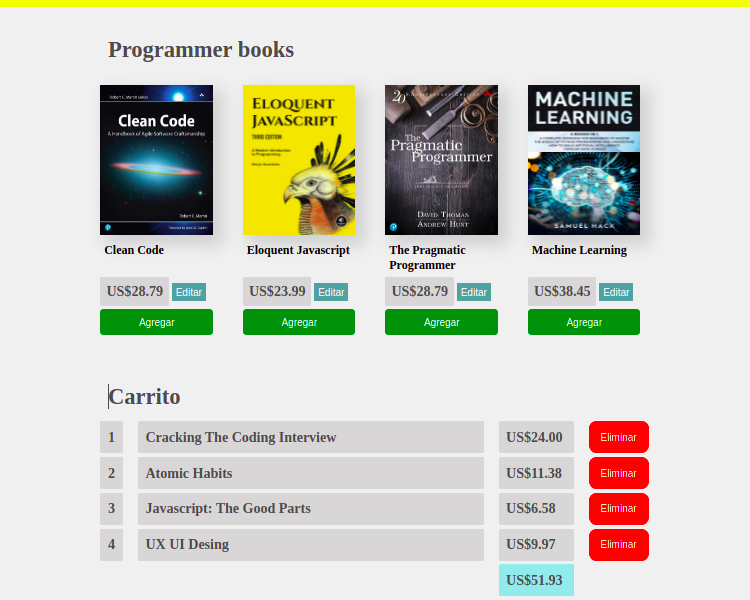

# Crud API Rest

Este proyecto es un crud, usando una API local creada con json-server.
Las solicitudes AJAX a la api las hice probando tres diferentes metodos: XMLHttpRequest, fetch y axios. La idea era usar todos los tipos de peticiones

- POST (CREATE): cuando se agrega un libro al carrito, inmediatamente se tiene que hacer un DELETE de este libro al stock.
- GET (READ): cuando se leen los datos la primera ves que se abre la pagina.
- PUT (UPDATE): cuando se cambia el precio de un libro hay que actualizar el precio en el stock.

 

 

## ¿Qué es una API Rest?

API Rest significa utilizar una API para acceder a aplicaciones back-end, de manera que esa comunicación se realice con los estándares definidos por el estilo de arquitectura Rest.

Si creas aplicaciones web con JavaScript, las API REST probablemente serán la forma principal de obtener datos para tus aplicaciones, así como la de enviar datos hacia una base de datos.

### Las principales solicitudes son:

POST (CREATE): crea datos en el servidor;
GET (READ): lectura de datos en el host;
PUT (UPDATE): actualiza los registros.
DELETE: borra la información;

### Las restricciones determinadas por la arquitectura Rest son:

- Cliente-servidor: las aplicaciones existentes en el servidor y el cliente deben estar separadas.
- Sin estado: cada peticion recibida por el servidor se va a manejar de manera independiente, es decir, cada una ejecuta solo una determinada acción.
- Caché: la API debe utilizar la caché para evitar llamadas recurrentes al servidor.

Cuando queremos trabajar con una nueva API no nos interesa con que lenguaje crearon la API, solo nos intereza leer la documentación para saber como consumir la información de la API para poder interactuar con los datos.

JSON Server es una API REST NodeJS para entornos de desarrollo y pruebas. La instalación es muy sencilla usando NPM:

`npm install -g json-server`

Una vez instalado creamos un fichero db.json con los datos, por ejemplo:

<pre><code class="json hljs">{
  "posts": [{ "id": 1, "title": "json-server", "author": "typicode" }],
  "comments": [{ "id": 1, "body": "some comment", "postId": 1 }],
  "profile": { "name": "typicode" }
}
</code></pre>

Arrancamos el servidor:

`json-server --watch db.json`

Ahora ya podemos abrir http://localhost:3000/posts/1 y nos devuelve:

`{ "id": 1, "title": "json-server", "author": "typicode" } Podemos obtener un registro por su ID por ejemplo http://localhost:3000/comments/1.`

Las operaciones POST, PUT, PATCH y DELETE modifican el fichero db.json (usando lowdb).

Postman es un cliente para hacer pruebas de las operaciones sobre la APIs, es importante hacer pruebas antes de comenzar a programar para saber si el servidor responde y si estamos mandando los datos correctos para que salgan bien las peticiones.

Nota: por defecto el JSON-server se levanta en el puerto 3000, y este puerto es usualmente utilizado por react, asi que podriamos cambiar el puerto del JSON-server:

`json-server -w -p 5000 db.json`
